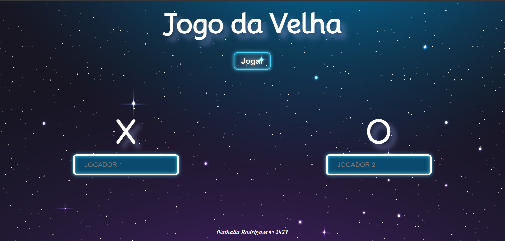
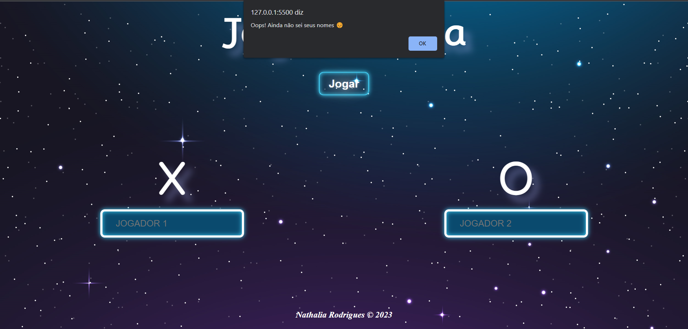
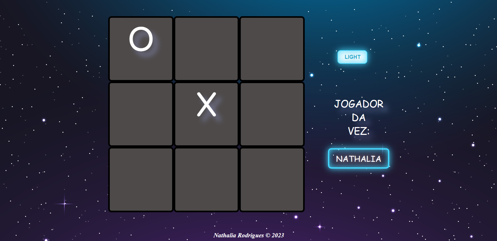
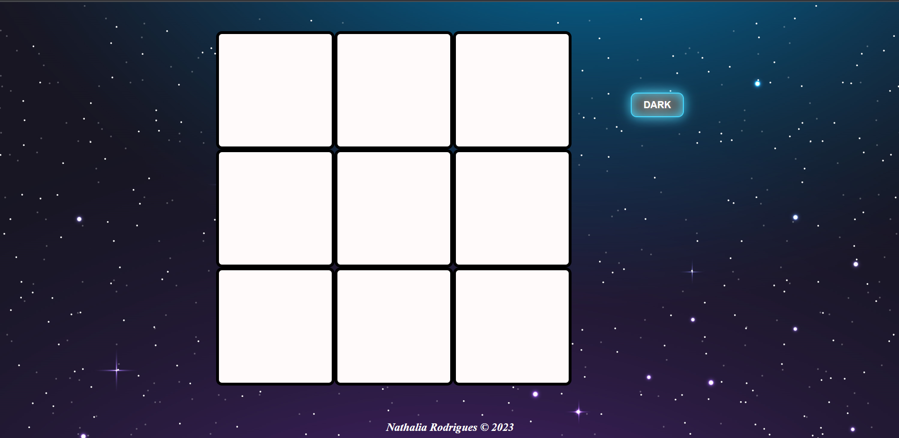

# Jogo da Velha
Jogo da Velha desenvolvido como parte da disciplina SI-401 (Programação para a Web) da Faculdade de Tecnlogia da UNICAMP, utilizando HTML, CSS & JavaScript.

<h1 align="center">
  
  
  
  
</h1>
